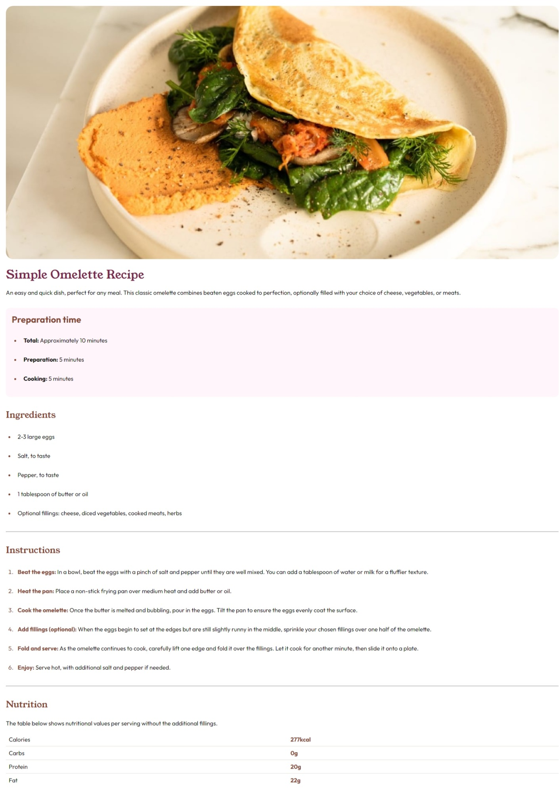

# Frontend Mentor - Recipe page solution

This is a solution to the [Recipe page challenge on Frontend Mentor](https://www.frontendmentor.io/challenges/recipe-page-KiTsR8QQKm).

## Table of contents

- [Overview](#overview)
  - [The challenge](#the-challenge)
  - [Screenshot](#screenshot)
  - [Links](#links)
- [My process](#my-process)
  - [Built with](#built-with)
- [Author](#author)

## Overview
This is a simple page I implemented using nextjs html and css
### Screenshot

### Links

- Solution URL: (https://github.com/henelngata/recipe-page)
- Live Site URL: (https://recipe-page-bay-eight.vercel.app/)

## My process
- Mobile first approach
- Write sematic html
- style up the page
- ensure responsiveness
- add any dynamic data
- test
- ship
### Built with

- Semantic HTML5 markup
- CSS custom properties
- Flexbox
- CSS Grid
- Mobile-first workflow
- [React](https://reactjs.org/) - JS library
- [Next.js](https://nextjs.org/) - React framework

## Author

- Website - [henry ngata](https://henryngata.notion.site/Henry-Ngata-Full-Stack-Web-Developer-4e851aa1113f43d7a5064b2d019a47f8)
- Frontend Mentor - [@henelngata](https://www.frontendmentor.io/profile/henelngata)
- Twitter - [@4hours_drive](https://www.twitter.com/4hours_drive)

